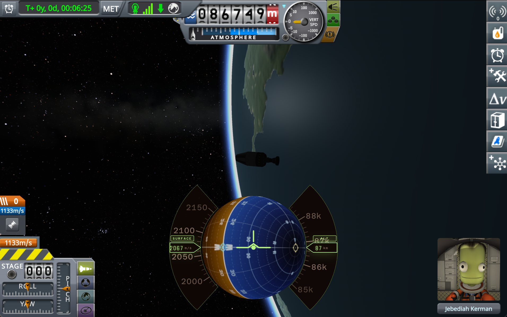

# Dragonglass

> ⚠️ **Early development.** This project is pre-release and under active, breaking churn. Only the **macOS / Apple Silicon** path is implemented today — Intel Macs, Linux, and Windows are not yet supported. Expect sharp edges.



## Why web UI for KSP?

KSP is built on a 2019-era Unity runtime, and it is no longer actively developed. Mods that want to build in-game UI are stuck with Unity IMGUI or the legacy uGUI Canvas: no flex or grid layout, no hot reload, no component model worth the name, no browser devtools, no npm ecosystem. Instrument panels that take a weekend in Svelte take months in Unity, and the tooling gap grows every year as the web stack moves and KSP's Unity doesn't.

Dragonglass treats the HUD as a web app. The UI is built in Svelte and TypeScript with CSS grid and any library off npm, developed with hot reload in a normal browser, and shipped to the game untouched. Chromium (via CEF) renders it in a sidecar process and hands KSP the finished frame as a shared GPU texture — so the runtime Unity never sees is also the runtime it never has to host. A secondary benefit falls out for free: the same UI code and telemetry stream can drive out-of-game surfaces like OBS overlays, second-screen MFDs, and mission-control dashboards.

The same separation pays off during development. Because the UI talks to KSP over a WebSocket (Dragonglass_Telemetry), the whole UI stack can run in a normal browser outside KSP — pulling live data from the running game — so component work, layout iteration, and state debugging happen with standard browser devtools and no KSP relaunch in the loop. Pointing the CEF sidecar at a Vite dev server URL instead of the packaged UI directory extends the same loop *inside the game*: save a Svelte file and the HUD re-renders in the Flight scene via HMR, no restart needed.

A pair of KSP mods for modern flight instrumentation:

- **Dragonglass_Hud** — overlays a web-based flight UI on top of the KSP Flight scene, rendered in [CEF](https://bitbucket.org/chromiumembedded/cef/) (Chromium Embedded Framework) and composited via a zero-copy shared GPU texture.
- **Dragonglass_Telemetry** — a standalone WebSocket server that broadcasts vessel state. The HUD's UI consumes it, but the stream can drive any external visualization (OBS overlays, second-screen MFDs, mission-control dashboards, …) independently.

The two ship as separate `GameData/` folders and can be installed independently. Dragonglass_Telemetry is pure C#; Dragonglass_Hud additionally requires a platform-specific CEF sidecar and native rendering plugin.

## Dragonglass_Hud

### Why a sidecar?

KSP's 2019-era Unity runtime can't host CEF in-process, so the HUD mod spawns a **sidecar process** that renders the UI in a headless Chromium instance and shares the resulting GPU texture with KSP via IOSurface. The KSP plugin composites this texture into the backbuffer each frame. Pixels travel the GPU-only path (zero-copy IOSurface) and input travels the SHM ring (no sockets, no serialization), so the round-trip should be dominated by frame cadence — not IPC.

The UI itself is a Svelte/TypeScript application — navball, instrument tapes, readouts, and other flight instruments — rendered by Chromium and transported to KSP as a single GPU texture. No pixel copies on the hot path.

### Architecture

```
┌─────────────────────────────┐   IOSurface (zero-copy)   ┌──────────────────────┐
│   CEF Sidecar               │ ─────── frames ─────────▶ │   KSP Plugin         │
│   (Rust)                    │                           │   (C# + native)      │
│                             │                           │                      │
│   Renders Svelte UI         │ ◀── input events ─────── │   Samples Unity mouse │
│   in headless CEF           │     (SHM ring buffer)     │   Composites texture │
└─────────────────────────────┘                           └──────────────────────┘
                                                                    │
                                                                    ▼
                                                            KSP backbuffer
```

**Zero-copy texture sharing.** The sidecar and plugin share a GPU texture across process boundaries. CEF renders each frame on the GPU; the sidecar publishes the IOSurface ID into a seqlock-protected header at the top of the shared-memory file. The plugin reads the ID each frame, wraps the surface as a native texture via the rendering plugin, and blits it into Unity's destination. No CPU pixels are ever touched. Currently implemented on macOS using IOSurface; other platforms would use their equivalent shared-texture mechanism (dmabuf on Linux, DXGI shared handles on Windows). There is no CPU fallback — the HUD mod requires a working zero-copy path.

**Input path.** The plugin samples Unity's mouse state each frame and writes pointer events (move, button, wheel) into an SPSC ring buffer inside the same shared-memory file. The sidecar drains the ring and injects synthesized mouse events into CEF. One mapped file carries both the frame header and the input ring.

### IPC

See `docs/ipc.md` for the byte-level shared-memory spec. The single mapped file (`$TMPDIR/dragonglass-<session>.shm`, where `<session>` is a per-KSP-instance ID so multiple instances don't collide) is one 4 KiB page containing:

- **Bytes 0–127** — frame header: magic, version, dimensions, seqlock, frame ID, IOSurface ID/generation.
- **Bytes 128+** — plugin→sidecar SPSC ring buffer of pointer events (move, button, wheel).

The sidecar is the frame writer and the input consumer; the plugin is the frame reader and the input producer. Synchronization is polled each Unity `Update()` via atomics on the header.

### Key invariants

- `crates/dg-shm/src/layout.rs` and `mod/Dragonglass.Hud/src/Layout.cs` must define identical byte offsets for every field (frame header **and** input ring). Any change to one must be mirrored in the other, and both must bump `VERSION` on any layout-breaking change.
- The HUD mod depends on the native rendering plugin being loadable at both the Mono PInvoke bundle path and the flat `libDgHudNative.dylib` path (both are shipped together).

## Dragonglass_Telemetry

A standalone KSP plugin that samples vessel state each frame and broadcasts it over a WebSocket. It has no dependency on Dragonglass_Hud — the HUD's UI is one of many possible consumers.

```
┌────────────────────────┐    ws://127.0.0.1:<port>     ┌──────────────────────┐
│   KSP Plugin           │ ──────────────────────────▶ │   Dragonglass_Hud UI │
│   (C#, standalone)     │            JSON             └──────────────────────┘
│                        │ ──────────────────────────▶   OBS overlays
│   Samples vessel state │ ──────────────────────────▶   Second-screen MFDs
│   each frame           │ ──────────────────────────▶   Mission-control dashboards
│   WebSocket broadcast  │ ──────────────────────────▶   …any other WS client
└────────────────────────┘
```

Pure C# — no sidecar, no native code. Installs as a self-contained `GameData/Dragonglass_Telemetry/` folder and runs anywhere KSP runs.

## Repository layout

```
dragonglass/
├── crates/                        Rust (Cargo workspace at repo root)
│   ├── dg-sidecar/                CEF host binary
│   ├── dg-shm/                    Shared-memory layout (frame seqlock + input ring)
│   └── dg-gpu/                    Cross-process GPU texture sharing (macOS: IOSurface/Metal)
│
├── mod/                           C# + native code (KSP side)
│   ├── Dragonglass.Hud/           HUD plugin — sidecar lifecycle, compositing, input forwarding
│   ├── Dragonglass.Telemetry/     Telemetry plugin — standalone WebSocket server
│   └── native/
│       └── darwin-universal/      DgHudNative — Obj-C/C++ Unity rendering plugin (GPU blit)
│
├── ui/                            TypeScript / Svelte (npm workspaces)
│   ├── packages/
│   │   ├── instruments/           @dragonglass/instruments — reusable flight instrument components
│   │   └── telemetry/             @dragonglass/telemetry — WebSocket client + typed vessel state
│   └── apps/
│       ├── stock/                 @dragonglass/stock — the shipped flight UI (deployed to UI/Stock)
│       └── workbench/             @dragonglass/workbench — experimentation (not shipped)
│
├── docs/
│   └── ipc.md                     Shared-memory header spec
│
├── Cargo.toml                     Cargo workspace root
├── justfile                       Top-level build orchestration
└── CLAUDE.md                      Development notes
```

## Platform support

**macOS only** for now. Dragonglass_Telemetry is platform-independent C# and runs anywhere KSP runs, but Dragonglass_Hud's shared GPU texture path is currently implemented using IOSurface and Metal/OpenGL interop. Linux and Windows support for the HUD would require platform-specific shared-texture implementations.

## Prerequisites

- **Rust** (stable, via [rustup](https://rustup.rs/))
- **Node.js** ≥ 18 and **npm**
- **.NET SDK** ≥ 6.0 (for `dotnet build` targeting .NET Framework 4.8)
- **Xcode Command Line Tools** (provides `clang++`, Metal/IOSurface frameworks)
- **[just](https://github.com/casey/just)** (command runner — `brew install just`)
- For `just sidecar-bundle`: `cargo install cef --features build-util --bin bundle-cef-app` (assembles the CEF framework into the sidecar `.app` bundle)

## Building

Individual components:

```sh
just ui-build           # TypeScript: typecheck + Vite production build
just ui-typecheck       # TypeScript: typecheck only
just sidecar-check      # Rust: cargo check (all crates)
just sidecar-test       # Rust: cargo test (runs seqlock stress test)
just sidecar-bundle     # Rust: build dg-sidecar + assemble macOS .app + ad-hoc codesign
just mod-build          # C#: dotnet build (both plugins)
just native-build-darwin  # Native: clang++ universal binary (x86_64 + arm64)
```

Everything at once:

```sh
just build              # ui-build + sidecar-bundle + mod-build + native-build-darwin
just check              # ui-typecheck + sidecar-check + dotnet build --no-restore
```

Development servers:

```sh
just ui-dev             # Stock flight UI with hot reload (Vite)
just ui-dev-workbench   # Workbench app with hot reload
```

## Packaging and install

Release zips are assembled under `release/`:

```sh
just dist-telemetry       # → release/Dragonglass_Telemetry.zip (platform-independent)
just dist-hud             # → release/Dragonglass_Hud.zip       (platform-independent: plugin DLL + UI)
just dist-hud-darwin-arm64  # → release/Dragonglass_Hud_darwin_arm64.zip (sidecar .app + native plugin)
just dist                 # all three
```

Install into a KSP directory (detects platform, unpacks the right sidecar bundle):

```sh
just install ~/KSP_osx
```

This drops `GameData/Dragonglass_Hud/` and `GameData/Dragonglass_Telemetry/` into the target install.
